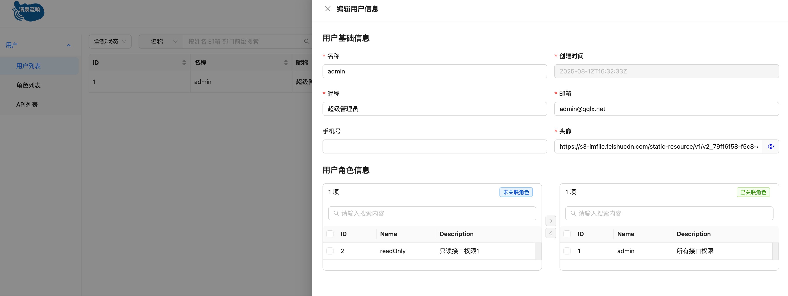
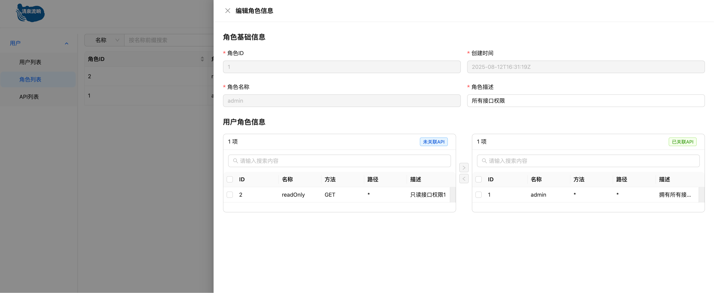
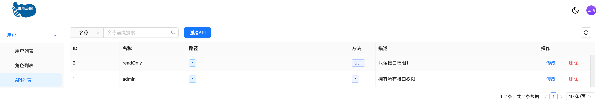

# apiserver

## 简介

GO 编写的 WEB 框架，此框架基于流行的`Gin`框架构建。

前端地址：[https://github.com/yiran15/ui.git](https://github.com/yiran15/ui.git)

预览地址：[清泉流响](https://qqlx.net/)

技术栈：

- gin       ---> web 框架
- zap       ---> 日志
- gorm      ---> mysql 数据持久化
- go-redis  ---> 缓存
- wire      ---> 依赖注入
- casbin    ---> 访问控制

## 功能

- 用户管理: 增删改查


- 角色管理: 增删改查


- 接口权限管理: 增删改查


## 部署

```bash
cd deploy

# 初始化配置文件, 需要修改配置文件中的数据库信息
mv config-example.yaml config.yaml

# 初始化数据库
mysql -h 127.0.0.1 -P 3306 -u root -p my_database < schema.sql

# 构建镜像
export IMAGE_NAME=xxx/xxx/api-server:$(git rev-parse --short HEAD)-$(date "+%Y%m%d-%H%M%S")
docker build -t ${IMAGE_NAME} ../
sed -i "s#image: api-server#image: ${IMAGE_NAME}#" docker-compose.yaml

docker compose up -d
```
