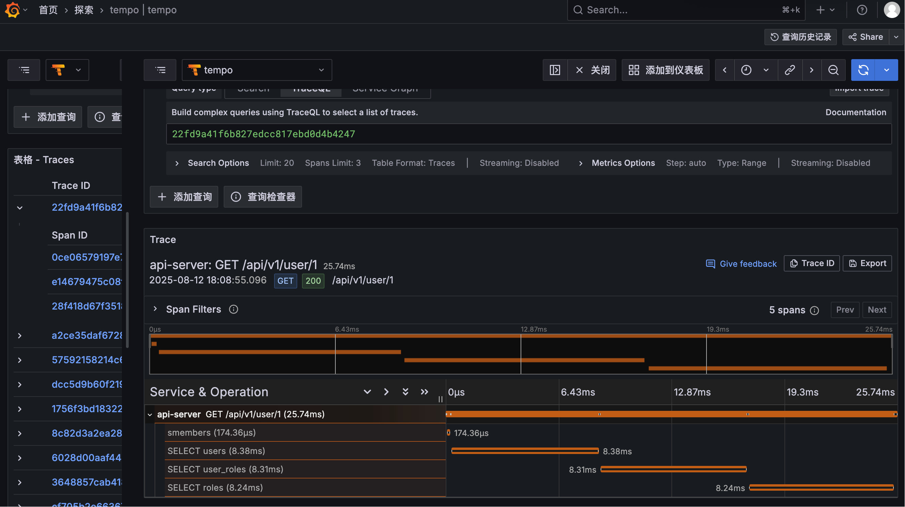
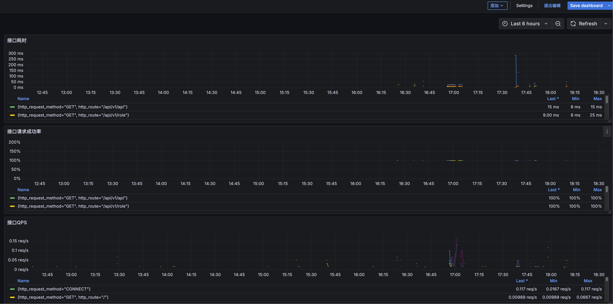

# apiserver

## 简介

GO 编写的 WEB 框架，此框架基于流行的`Gin`框架构建。

前端地址：[https://github.com/yiran15/ui.git](https://github.com/yiran15/ui.git)

预览地址：[清泉流响](https://qqlx.net/)

账号: `readonly@qqlx.net`
密码: `12345678`

## 技术栈

- gin       ---> web 框架
- zap       ---> 日志
- gorm      ---> mysql 数据持久化
- go-redis  ---> 缓存
- wire      ---> 依赖注入
- casbin    ---> 访问控制
- otel      ---> 可观测性

## 功能

- 用户管理: 增删改查


- 角色管理: 增删改查


- 接口权限管理: 增删改查


## 可观测性

基于`otel`的可观测性，包括`trace`、`metrics`。

使用 [阿里云 otel](https://github.com/alibaba/loongsuite-go-agent) 构建镜像，自动注入`trace`、`metrics`。

## 配置 trace & metrics 导出

- OTEL_EXPORTER_OTLP_ENDPOINT: otlp 服务地址
- OTEL_EXPORTER_OTLP_PROTOCOL: otlp 服务协议
- OTEL_SERVICE_NAME: 服务名称
- OTEL_METRICS_EXPORTER: metrics 导出方式为`prometheus`格式
- OTEL_EXPORTER_PROMETHEUS_PORT: metrics 导出端口
- OTEL_EXPORTER_PROMETHEUS_HOST: metrics 导出主机

```bash
cat deploy/docker-compose.yaml
services:
  apiserver:
    image: api-server
    restart: always
    container_name: apiserver
    environment:
      - CONFIG_PATH=/app/config.yaml
      - OTEL_EXPORTER_OTLP_ENDPOINT=http://10.10.10.10:30001
      - OTEL_EXPORTER_OTLP_PROTOCOL=grpc
      - OTEL_SERVICE_NAME=api-server
      # - OTEL_METRICS_EXPORTER=prometheus
      # - OTEL_EXPORTER_PROMETHEUS_PORT=9464
      # - OTEL_EXPORTER_PROMETHEUS_HOST=0.0.0.0
```

### Trace



### Metrics



## 部署

```bash
cd deploy

# 初始化配置文件, 需要修改配置文件中的数据库信息
mv config-example.yaml config.yaml

# 初始化数据库
mysql -h 127.0.0.1 -P 3306 -u root -p my_database < schema.sql

# 构建镜像
export IMAGE_NAME=xxx/xxx/api-server:$(git rev-parse --short HEAD)-$(date "+%Y%m%d-%H%M%S")
docker build -t ${IMAGE_NAME} ../
sed -i "s#image: api-server#image: ${IMAGE_NAME}#" docker-compose.yaml

docker compose up -d
```
